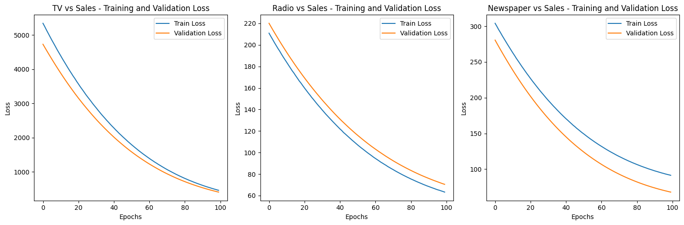
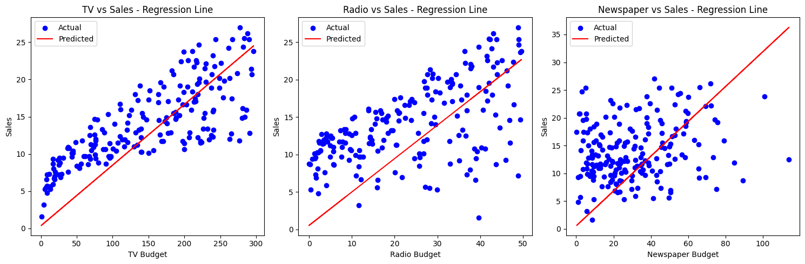

# Lab Record: Introduction to Linear Regression

---

## Introduction

Linear regression is a fundamental statistical method used to model the relationship between a dependent variable and one or more independent variables. It assumes a linear relationship between the variables, meaning that a change in the independent variable(s) results in a proportional change in the dependent variable. This lab explores linear regression using various techniques, including machine learning and traditional statistical methods, to analyze the relationship between advertising budgets and sales.

## Dataset and Initial Analysis

The dataset used in this lab is the "Advertising" dataset, which contains information about advertising budgets for TV, radio, and newspapers, along with the corresponding sales figures. The dataset was loaded from a GitHub repository and initially analyzed using scatter plots to visualize the relationships between the variables.

**Initial Observations:**

* The scatter plot of TV advertising budget vs. sales suggests a positive linear relationship, indicating that higher TV advertising budgets tend to be associated with higher sales.
* The scatter plot of radio advertising budget vs. sales also shows a positive linear relationship, but it appears to be weaker than the relationship between TV advertising and sales.
* The scatter plot of newspaper advertising budget vs. sales does not exhibit a clear linear relationship, suggesting that newspaper advertising may not be a strong predictor of sales.

## Models Description

### 1. Linear Regression Model using Machine Learning

This model utilizes machine learning libraries, specifically TensorFlow and Keras, to build a linear regression model. The data for each advertising medium (TV, radio, newspaper) was split into training and testing sets. Separate neural networks with a single dense layer were created for each medium. The models were trained using the Adam optimizer and mean squared error loss function.

**Key Points:**

* The models were evaluated based on their test loss, which measures the average squared difference between predicted and actual sales values on the test set.
* Training and validation loss curves were plotted to monitor the learning process and identify potential overfitting.
* Regression lines were plotted to visualize the predicted relationship between advertising budgets and sales for each medium.

### 2. Linear Regression Model using Scikit-learn (without ML Libraries)

This model employs the LinearRegression class from the scikit-learn library, which provides a traditional statistical approach to linear regression. The data was prepared and split similarly to the machine learning model.

**Key Points:**

* The models were trained using the fit method, which estimates the coefficients of the linear regression equation.
* The models were evaluated using mean squared error (MSE), a common metric for regression problems.
* Regression lines were plotted to visualize the predicted relationship between advertising budgets and sales for each medium.

### 3. Linear Regression Model without using Scikit-learn or ML Libraries

This section explores two approaches to linear regression without relying on external libraries:

**A. Using Machine Learning Principles:**

* A custom implementation of the Adam optimizer was used to update the weights and bias of the linear regression model iteratively.
* The mean squared error loss function was used to measure the model's performance.
* The model was trained for a specified number of epochs, and the loss history was recorded.
* Regression lines were plotted to visualize the predicted relationship between advertising budgets and sales for each medium.

**B. Using Coefficient of Regression:**

* The slope and intercept of the linear regression equation were calculated manually using the formula for the coefficient of regression.
* The predicted sales values were calculated using the estimated slope and intercept.
* Regression lines were plotted to visualize the predicted relationship between advertising budgets and sales for each medium.

## Results

The results of the linear regression analysis are presented in the form of plots, including:

* **Scatter Plots:** These plots show the relationship between each advertising medium and sales, providing an initial visual assessment of the data.
* **Training and Validation Loss Curves:** These plots (for the machine learning models) illustrate the model's learning progress and help identify potential overfitting.
* **Regression Lines:** These plots depict the predicted relationship between advertising budgets and sales for each medium, based on the estimated coefficients of the linear regression models.

**Observations from the Plots:**

* The machine learning models and the scikit-learn models produced similar regression lines, indicating that both approaches effectively captured the linear relationship between advertising budgets and sales.
* The custom implementation of linear regression using machine learning principles also yielded comparable results, demonstrating the feasibility of building a linear regression model from scratch.
* The regression lines obtained using the coefficient of regression method were consistent with the other models, confirming the validity of this traditional statistical approach.

## Conclusion

This lab explored various techniques for performing linear regression analysis, ranging from machine learning models to traditional statistical methods. The results demonstrate that linear regression is a powerful tool for modeling the relationship between variables and predicting outcomes. The choice of method depends on the specific requirements of the analysis, such as the need for scalability, interpretability, or computational efficiency.
